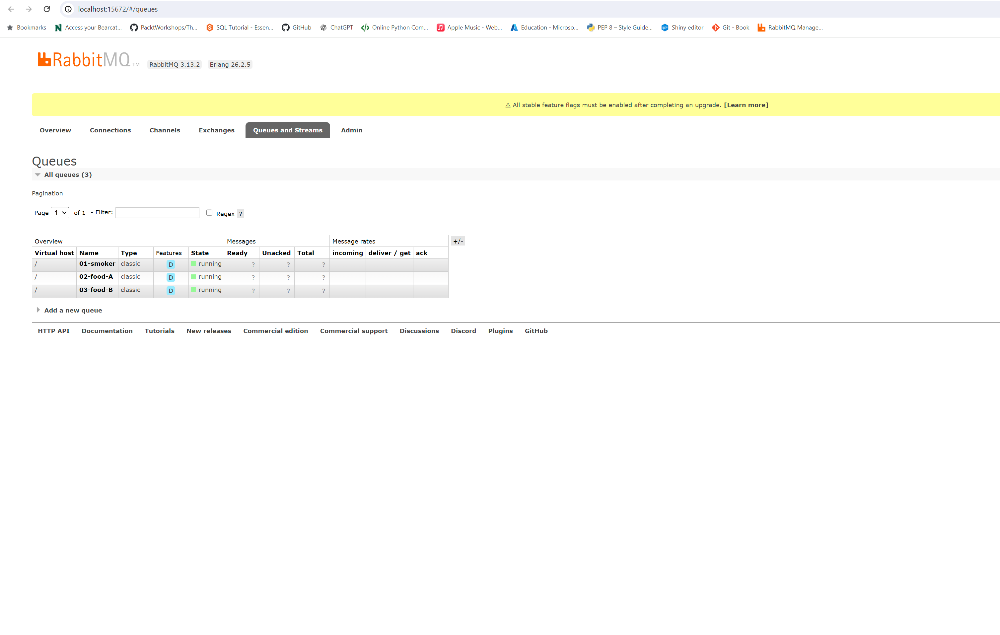
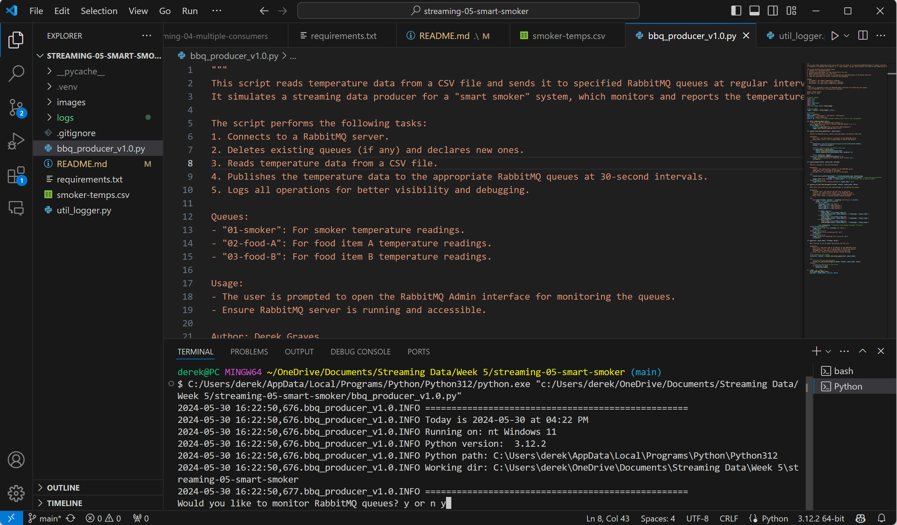
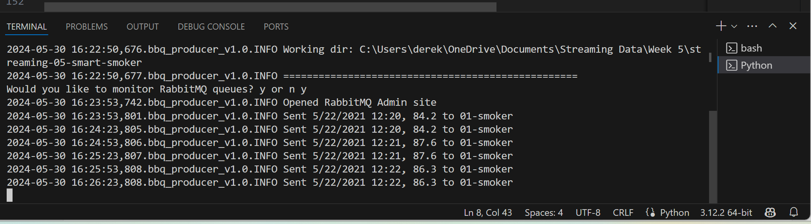

# streaming-05-smart-smoker
This project simulates a streaming data producer for a "smart smoker" system. It reads temperature data from a CSV file and sends it to specified RabbitMQ queues at regular intervals. The system monitors and reports the temperatures of the smoker and the food items being cooked.

The script performs the following tasks:

1. Connects to a RabbitMQ server.
2. Deletes existing queues (if any) and declares new ones.
3. Reads temperature data from a CSV file.
4. Publishes the temperature data to the appropriate RabbitMQ queues at 30-second intervals.
5. Logs all operations for better visibility and debugging.

## Author

- Derek Graves
- May 31, 2024

## Prior to Beginning

1. Fork starter repo into GitHub.
2. Clone repo down to machine.
3. In VS Code, select python interpreter:
- View > Command Palette

## Setup 

1. Use previous emitter file V3 as template and copy to root project folder: https://github.com/dgraves4/streaming-04-multiple-consumers/blob/main/v3_emitter_of_tasks.py. Rename bbq_producer_v1.0.

2. Create virtual environment:
```bash
py -m venv .venv
```
3.  Activate environment:
```bash
source .venv/scripts/activate
```
4.  Install external packages:
```bash
pip install pika
```
or you can install from 'requirements.txt':

```bash
pip install -r requirements.txt
```

5. Rabbit MQ Installation
- Follow instructions on [RabbitMQ Installation](https://www.rabbitmq.com/tutorials) to install RabbitMQ.
- Ensure the RabbitMQ server is running on your machine once installed.

6. Add additional files:
- Add a .gitignore file (copied from earlier module) https://github.com/dgraves4/streaming-04-multiple-consumers/blob/main/.gitignore.
- Add CSV data file to root project folder 'smoker-temps.csv'.

## Directory Structure
```bash
streaming-05-smart-smoker/
├── .venv/
├── images/
├── .gitignore
├── bbq_producer_v1.0.py
├── consumer_smoker.py
├── consumer_food_a.py
├── consumer_food_b.py
├── etexter.py
├── requirements.txt
├── smoker-temps.csv
├── util_logger.py
└── README.md
```
## Design and Implement Producer
- Copy util_logger.py into project folder if you wish to use the logging utility.
- Create producer script:
1. Start with useful docstring at the top of file and include Author name and Date.
2. List imports needed for the script.
3. Declare all  constants such as 'HOST', 'QUEUE_NAMES', 'CSV_FILE', and 'DELAY'.
4. Define all functions:
- 'offer_rabbitmq_admin_site()'
```bash
def offer_rabbitmq_admin_site():
    """Offer to open the RabbitMQ Admin website."""
    ans = input("Would you like to monitor RabbitMQ queues? y or n ")
    if ans.lower() == "y":
        webbrowser.open_new("http://localhost:15672/#/queues")
        logger.info("Opened RabbitMQ Admin site")
```
- 'connect_and_setup_queues()'
```bash
def connect_and_setup_queues(host, queue_names):
    """
    Connect to RabbitMQ server, delete existing queues, and declare them anew.

    Parameters:
        host (str): the host name or IP address of the RabbitMQ server
        queue_names (list): list of queue names to delete and declare
    """
    try:
        connection = pika.BlockingConnection(pika.ConnectionParameters(host))
        channel = connection.channel()

        # Delete existing queues and declare them anew
        for queue_name in queue_names:
            channel.queue_delete(queue=queue_name)
            channel.queue_declare(queue=queue_name, durable=True)

        return connection, channel
    except pika.exceptions.AMQPConnectionError as e:
        logger.error(f"Connection to RabbitMQ server failed: {e}")
        sys.exit(1)
```
- 'send_message()'
```bash
def send_message(channel, queue_name, message):
    """
    Publish a message to the specified queue.

    Parameters:
        channel: the communication channel to the RabbitMQ server
        queue_name (str): the name of the queue
        message (str): the message to be sent to the queue
    """
    try:
        channel.basic_publish(exchange="", routing_key=queue_name, body=message,
                              properties=pika.BasicProperties(delivery_mode=2))  # make message persistent
        logger.info(f"Sent {message} to {queue_name}")  # log the message sent to specific queue
    except Exception as e:
        logger.error(f"Error sending message to {queue_name}: {e}")
```
- 'process_csv_and_send_messages()'
```bash
def process_csv_and_send_messages(filename, channel, queue_names, delay):
    """
    Read tasks from a CSV file and send messages to the appropriate queues.

    Parameters:
        filename (str): the name of the CSV file to read from
        channel: the communication channel to the RabbitMQ server
        queue_names (list): list of queue names to send messages to
        delay (int): delay in seconds between sending messages
    """
    try:
        with open(filename, newline='', encoding='utf-8-sig') as csvfile:
            reader = csv.DictReader(csvfile)
            for row in reader:
                timestamp = row['Time (UTC)']
                smoker_temp_str = row['Channel1']
                food_a_temp_str = row['Channel2']
                food_b_temp_str = row['Channel3']

                if smoker_temp_str:
                    smoker_temp = float(smoker_temp_str)
                    send_message(channel, queue_names[0], f"{timestamp}, {smoker_temp}")
                if food_a_temp_str:
                    food_a_temp = float(food_a_temp_str)
                    send_message(channel, queue_names[1], f"{timestamp}, {food_a_temp}")
                if food_b_temp_str:
                    food_b_temp = float(food_b_temp_str)
                    send_message(channel, queue_names[2], f"{timestamp}, {food_b_temp}")

                time.sleep(delay)  # Simulate sleep between messages 30 seconds
    except FileNotFoundError:
        logger.error(f"CSV file {filename} not found.")
        sys.exit(1)
    except ValueError as e:
        logger.error(f"Error processing CSV: {e}")
        sys.exit(1)
    except Exception as e:
        logger.error(f"An unexpected error occurred: {e}")
        sys.exit(1)
```
- 'main'
```bash
def main(host, queue_names, filename, delay):
    """
    Main function to set up queues and process the CSV file.

    Parameters:
        host (str): the host name or IP address of the RabbitMQ server
        queue_names (list): list of queue names to delete and declare
        filename (str): the name of the CSV file to read from
        delay (int): delay in seconds between sending messages
    """
    # Get connection and channel
    connection, channel = connect_and_setup_queues(host, queue_names)

    try:
        # Process CSV and send messages
        process_csv_and_send_messages(filename, channel, queue_names, delay)
    finally:
        # Close the connection to the server
        if connection.is_open:
            connection.close()
```
5. Finally, call the main function, which completes the following:
- Establishes a connection to the RabbitMQ server running on localhost.
- Deletes any existing queues named "01-smoker", "02-food-A", and "03-food-B" and then declares new queues with these names.
- Processes a CSV file containing smoker temperature data.
- For each row in the CSV file, it extracts the timestamp, smoker temperature, food A temperature, and food B temperature.
- If the smoker temperature is available (not empty), it converts it to a float and sends a message to the "01-smoker" queue.
- Similarly, if food A or food B temperatures are available, it converts them to float and sends messages to the respective queues.

```bash
if __name__ == "__main__":
    offer_rabbitmq_admin_site()
    main(HOST, QUEUE_NAMES, CSV_FILE, DELAY)
```

## Design and Implement Consumers

1. Create three consumer files, one for the smoker temperature, and one each to monitor food A and B temperatures. Each script monitors a different aspect of the temperature data and logs significant events.
- Create consumer_smoker.py
```bash
# Configure logging
logging.basicConfig(level=logging.INFO)
logger = logging.getLogger(__name__)

# Constants
QUEUE_NAME = '01-smoker'
DEQUE_MAX_LENGTH = 5  # 2.5 minutes worth of readings (5 * 30 seconds)
TEMPERATURE_DROP_THRESHOLD = 15  # Degrees Fahrenheit

def smoker_callback(ch, method, properties, body):
    """Process messages from the smoker queue."""
    message = body.decode()  # Decode the message body
    timestamp, temperature_str = message.split(', ')
    temperature = float(temperature_str)
    logger.info(f"Received temperature: {temperature}")

    # Add to deque and check for temperature drop
    temperature_readings.append(temperature)
    if len(temperature_readings) == DEQUE_MAX_LENGTH:
        temp_diff = temperature_readings[0] - temperature_readings[-1]
        if temp_diff >= TEMPERATURE_DROP_THRESHOLD:
            logger.warning(f"Smoker Alert! Temperature dropped by {temp_diff}°F")
        temperature_readings.popleft()

    # Acknowledge message
    ch.basic_ack(delivery_tag=method.delivery_tag)

def main():
    """Main function to set up RabbitMQ consumer."""
    connection = pika.BlockingConnection(pika.ConnectionParameters('localhost'))
    channel = connection.channel()

    # Declare the queue
    channel.queue_declare(queue=QUEUE_NAME, durable=True)

    # Set up consumption of messages
    channel.basic_consume(queue=QUEUE_NAME, on_message_callback=smoker_callback, auto_ack=False)

    logger.info('Waiting for smoker messages...')
    channel.start_consuming()

if __name__ == "__main__":
    # Deque for storing recent temperature readings
    temperature_readings = deque(maxlen=DEQUE_MAX_LENGTH)
    main()
```
- Create consumer_food_a.py and consumer_food_b.py files:
```bash
# Configure logging
logging.basicConfig(level=logging.INFO)
logger = logging.getLogger(__name__)

# Constants
QUEUE_NAME = '02-food-A'
DEQUE_MAX_LENGTH = 20  # 10 minutes worth of readings (20 * 30 seconds)
TEMPERATURE_CHANGE_THRESHOLD = 1  # Degrees Fahrenheit

# Load secrets from .env.toml
def load_secrets(file_path='.env.toml'):
    """Load secrets from the .env.toml file."""
    with open(file_path, 'rb') as f:
        return tomli.load(f)

def create_and_send_text_alert(text_message: str):
    """Send a text alert using the SMTP-to-SMS gateway."""
    secrets = load_secrets()
    host = secrets["outgoing_email_host"]
    port = secrets["outgoing_email_port"]
    outemail = secrets["outgoing_email_address"]
    outpwd = secrets["outgoing_email_password"]
    sms_address = secrets["sms_address_for_texts"]

    msg = EmailMessage()
    msg["From"] = outemail
    msg["To"] = sms_address
    msg.set_content(text_message)

    try:
        server = smtplib.SMTP(host, port)
        server.starttls()
        server.login(outemail, outpwd)
        server.send_message(msg)
        logger.info("Text alert sent successfully.")
    except smtplib.SMTPAuthenticationError:
        logger.error("Authentication error. Verify your email and password.")
    except Exception as e:
        logger.error(f"Error: {e}")
    finally:
        server.quit()

def food_a_callback(ch, method, properties, body):
    """Process messages from the food A queue."""
    message = body.decode()  # Decode the message body
    timestamp, temperature_str = message.split(', ')
    temperature = float(temperature_str)
    logger.info(f"Received temperature: {temperature}")

    # Add to deque and check for temperature stall
    temperature_readings.append(temperature)
    if len(temperature_readings) == DEQUE_MAX_LENGTH:
        temp_diff = max(temperature_readings) - min(temperature_readings)
        if temp_diff <= TEMPERATURE_CHANGE_THRESHOLD:
            alert_message = f"Food A Stall Alert! Temperature change ≤ 1°F at {timestamp}"
            logger.warning(alert_message)
            create_and_send_text_alert(alert_message)
        temperature_readings.popleft()

    # Acknowledge message
    ch.basic_ack(delivery_tag=method.delivery_tag)

def main():
    """Main function to set up RabbitMQ consumer."""
    connection = pika.BlockingConnection(pika.ConnectionParameters('localhost'))
    channel = connection.channel()

    # Declare the queue
    channel.queue_declare(queue=QUEUE_NAME, durable=True)

    # Set up consumption of messages
    channel.basic_consume(queue=QUEUE_NAME, on_message_callback=food_a_callback, auto_ack=False)

    logger.info('Waiting for food A messages...')
    channel.start_consuming()

if __name__ == "__main__":
    # Deque for storing recent temperature readings
    temperature_readings = deque(maxlen=DEQUE_MAX_LENGTH)
    main()
```

## Running the Project

1. Start the producer:
- Execute the producer script to begin sending temperature data to the RabbitMQ queues:
```bash
python bbq_producer_v1.0.py
```
- This will read data from the smoker-temps.csv file and publish it to the specified queues (01-smoker, 02-food-A, 03-food-B) at 30-second intervals. The producer logs the operations and status updates to the console.

2. Run each consumer script:
- Open three separate terminal windows or tabs for running the consumers.  Run each file separately:
```bash
# For Smoker Temperature:
python consumer_smoker.py

# For Food A Temperature:
python consumer_food_a.py

# For Food B Temperature:
python consumer_food_b.py
```
3. Monitor Logs and RabbitMQ Admin
- Each consumer will log received temperature data and significant events to the console. Monitor these logs to observe how the consumers process the temperature data and detect alerts.
- You can monitor the RabbitMQ queues using the RabbitMQ Admin interface: http://localhost:15672/#/queues.

4. Example Output for Producer console:
```bash
INFO:__main__:Sent 2024-06-07 12:30:00, 225.4 to 01-smoker
INFO:__main__:Sent 2024-06-07 12:30:00, 175.3 to 02-food-A
INFO:__main__:Sent 2024-06-07 12:30:00, 165.8 to 03-food-B
```

5. Example Output for Consumer consoles:
```bash
INFO:__main__:Received temperature: 225.4
INFO:__main__:Received temperature: 175.3
WARNING:__main__:Food A Stall Alert! Temperature change ≤ 1°F
```

6.  To close the project, you will need to stop both consumers and producers in their consoles.  Use Ctrl+C in each terminal window to do so. 

## Screenshots

See a running example of the code executing in the terminal, as well as an example of RabbitMQ Admin displaying that all queues are running:




## Future Enhancements
- Consumers: Next module will see the addition of consumers to process the messages from the queues. 
- Alerts: Implementing alter mechanisms for events detected in temperature data (via email, etc.).

## Sources

- [Project 4 Repository](https://github.com/dgraves4/streaming-04-multiple-consumers)
- [RabbitMQ Tutorials](https://www.rabbitmq.com/tutorials)
- [OpenAI](https://chatgpt.com/)


